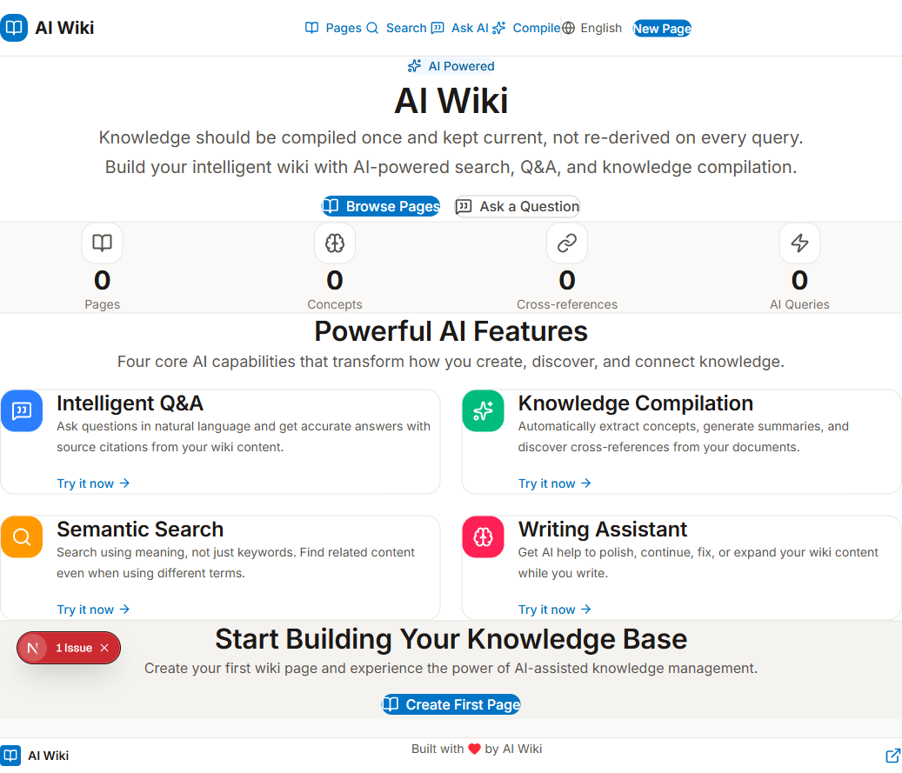
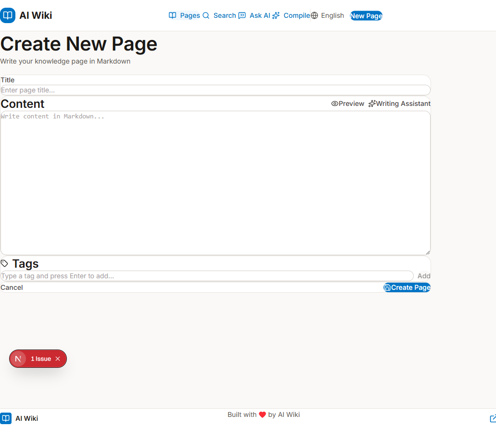
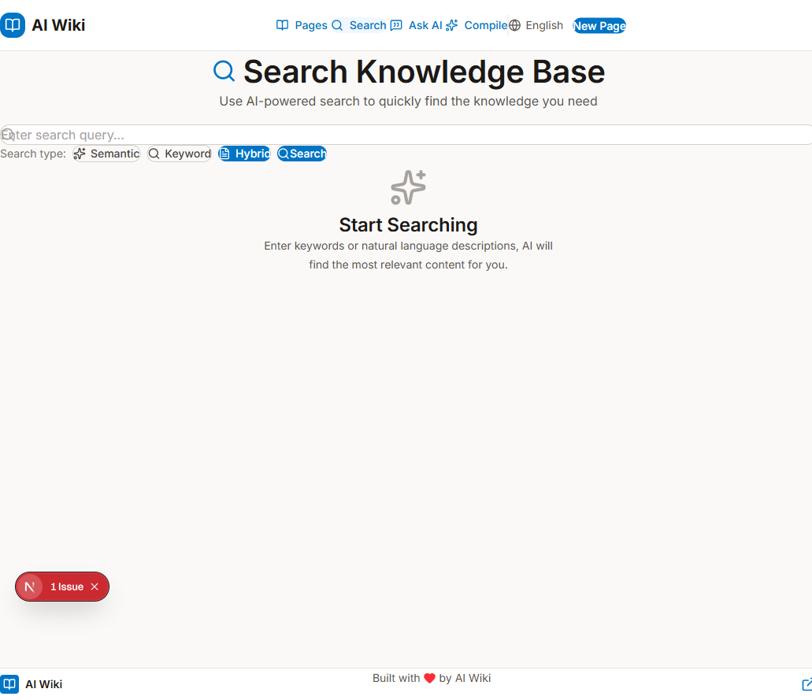
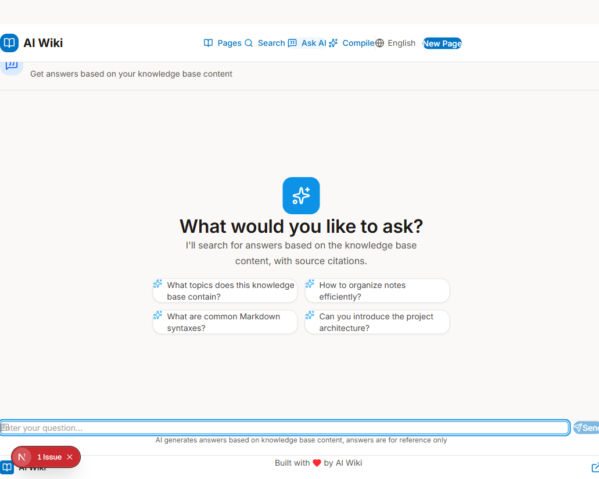
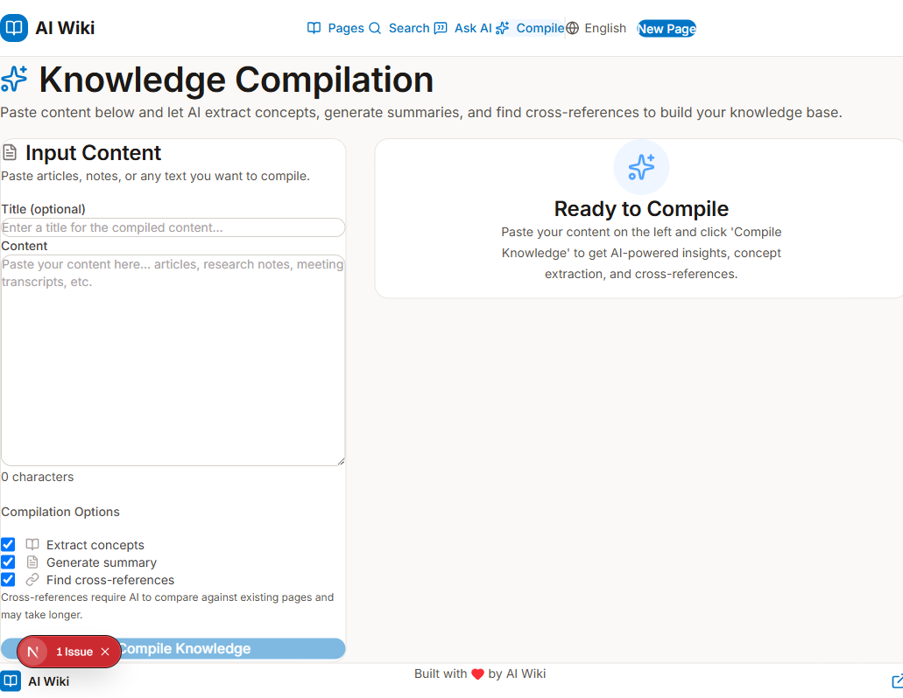
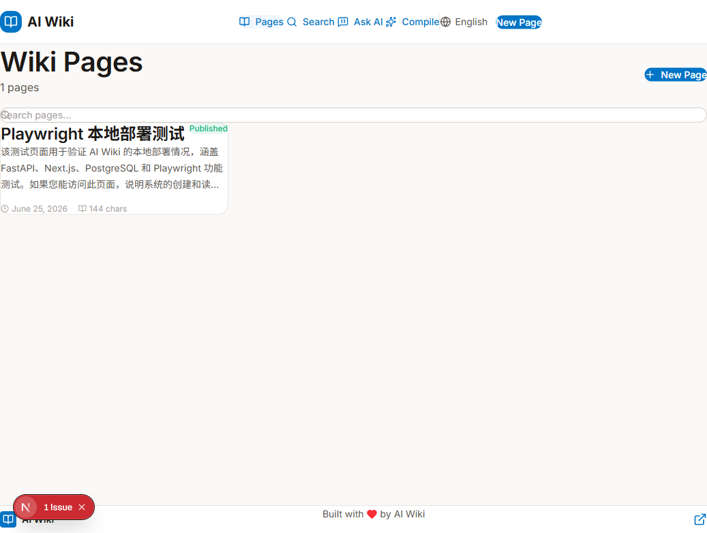

# 🧠 AI Wiki - 动态知识库

> 传统知识库只是把笔记「存起来」，写完就死了。AI Wiki 是一个**会自己生长、会理解你、会动态服务你的活知识库**。

灵感来自 Karpathy 的 LLM Wiki 理念：知识应该被编译一次并保持最新，而不是每次查询重新派生。AI Wiki 把传统的「存储-检索」模式升级为「编译-复用」模式——每加一条知识，AI 会实时把它编译成结构化资产，让知识自动长成关联网络，并通过 RAG 问答和语义搜索实现动态服务。

## 🔄 为什么是「动态」知识库？

| 传统知识库（静态） | AI Wiki（动态） |
|---|---|
| 写完就躺着，互相不认识 | 每加一条，AI 自动发现交叉引用，知识**自动生长**成网络 |
| 原始内容就是全部 | AI 实时编译出摘要/概念/标签，**动态加工**成更易用的资产 |
| FAQ 是预写的固定问答 | RAG 实时推导答案 + 来源，问法千变万化都能**动态应答** |
| 关键词死匹配，换词搜不到 | 语义理解意图，换个说法也能**动态检索** |

**一句话**：传统知识库是「只负责存的死仓库」，AI Wiki 是「越用越聪明、越写越互联的活系统」。


## ✨ 核心特性

- 🤖 **RAG 智能问答** — 基于知识库内容实时推导答案，附来源引用与置信度
- 📚 **知识编译** — 并发提取概念/摘要/标签/交叉引用，让知识自动结构化、自动关联
- 🔍 **语义搜索** — 基于 embedding 的语义/关键词/混合三种模式，换词也能找到
- ✍️ **AI 写作助手** — 润色、续写、纠错、扩展，辅助知识创作
- 🌐 **中英双语** — 完整 i18n 覆盖，无硬编码混杂
- 🐳 **一键部署** — Docker Compose 拉起 PostgreSQL + FastAPI + Next.js
- 🧪 **测试闭环** — pytest 单元测试 + Playwright E2E

## 🛠️ 技术栈

`Next.js 16` · `React 19` · `TypeScript` · `Tailwind CSS 4` · `FastAPI` · `SQLAlchemy` · `PostgreSQL` · `Anthropic 兼容 LLM`

## 📸 界面预览

| 首页 | 创建页面 | 语义搜索 |
|:---:|:---:|:---:|
|  | [](docs/screenshots/02-create-page.png) | [](docs/screenshots/03-search.png) |

| AI 问答 | 知识编译 | 页面列表 |
|:---:|:---:|:---:|
| [](docs/screenshots/04-ask.png) | [](docs/screenshots/05-compile.png) | [](docs/screenshots/06-pages-list.png) |

## ✨ 功能特性

### 🤖 四大 AI 功能

1. **智能问答（RAG）** — 用自然语言提问，从 Wiki 内容中获取准确答案并附带来源引用
2. **知识编译** — 自动提取概念、生成摘要、发现文档中的交叉引用
3. **语义搜索** — 按含义搜索，而非关键词，即使使用不同术语也能找到相关内容
4. **写作助手** — 写作时获得 AI 帮助，润色、续写、纠错或扩展你的 Wiki 内容

### 🎯 项目亮点

- 📚 **Wiki 页面** — 创建、编辑和组织知识页面
- 🔍 **智能搜索** — 语义搜索 + 关键词搜索 + 混合搜索
- 💡 **AI 问答** — 基于知识库内容的智能问答
- 🔗 **知识编译** — 自动提取概念和交叉引用
- 🌐 **中英文双语** — 支持语言切换，默认中文
- 🎨 **专业设计** — 参考 Impeccable 和 UI UX Pro Max 理念

## 🛠️ 技术栈

| 层 | 技术 | 说明 |
|-------|-----------|---------|
| **前端** | Next.js 16 + React 19 + TypeScript | 现代 Web 框架 |
| **样式** | Tailwind CSS 4 | 实用优先 CSS |
| **后端** | Python FastAPI | 高性能 API |
| **数据库** | PostgreSQL 16.3 | 结构化数据存储 |
| **AI** | 小米 MiMo API | 语言模型服务 |

## 🚀 快速开始

### 前置要求

- Python 3.11（推荐，与后端 Dockerfile 对齐）
- Node.js >= 20.9.0（Next.js 16 要求）
- PostgreSQL 16.3（本机开发环境位于 D:\PostgreSQL\16）

### 1. 克隆项目

```bash
git clone https://github.com/yourusername/ai-wiki.git
cd ai-wiki
```

### 2. 配置环境变量

```bash
# 编辑 backend/.env 文件
# 填入你的 API 密钥
```

### 3. 启动项目

```bash
# 终端 1：启动后端
cd "D:/ai-wiki/backend"
python -m uvicorn app.main:app --reload --host 127.0.0.1 --port 8000

# 终端 2：启动前端
cd "D:/ai-wiki/frontend"
npm run dev
```

### 4. 访问应用

- **前端界面**：http://localhost:3000
- **后端 API**：http://localhost:8000
- **API 文档**：http://localhost:8000/docs

> ⚠️ 开发时请用 `http://localhost:3000` 访问前端，不要用 `http://127.0.0.1:3000`。Next.js 16 默认阻止非 localhost 的 dev 资源（HMR），如需用 127.0.0.1，已在 `next.config.ts` 配置 `allowedDevOrigins`。

### Docker Compose（开发环境）

```bash
# 复制并填写环境变量，真实密钥不要提交到仓库
cp .env.example .env

# 构建并启动 PostgreSQL + FastAPI + Next.js
cd "D:/ai-wiki"
docker compose up --build
```

默认端口：

- 前端：http://localhost:3000
- 后端：http://localhost:8000
- Docker PostgreSQL：localhost:5433（容器内仍为 db:5432，避免和本机 PostgreSQL 5432 冲突）

## 📁 项目结构

```
ai-wiki/
├── frontend/                # Next.js 前端
│   ├── src/
│   │   ├── app/            # App Router 页面
│   │   ├── components/     # React 组件
│   │   │   ├── ui/        # UI 组件库
│   │   │   └── layout/    # 布局组件
│   │   └── lib/           # 工具函数和 API 客户端
│   └── package.json
│
├── backend/                 # FastAPI 后端
│   ├── app/
│   │   ├── api/           # API 路由
│   │   │   ├── pages.py  # 页面 CRUD
│   │   │   ├── ai.py     # AI 功能
│   │   │   └── search.py # 搜索接口
│   │   ├── core/          # 配置和数据库
│   │   ├── models/        # SQLAlchemy 模型
│   │   ├── schemas/       # Pydantic 模式
│   │   └── services/      # AI 服务逻辑
│   └── requirements.txt
│
├── scripts/                 # 数据库脚本
├── docs/                    # 项目文档
└── docker-compose.yml       # Docker 配置
```

## 📚 API 文档

### 页面 API

| 方法 | 端点 | 说明 |
|------|------|------|
| `GET` | `/api/pages` | 获取页面列表 |
| `GET` | `/api/pages/{slug}` | 获取单个页面 |
| `POST` | `/api/pages` | 创建页面 |
| `PUT` | `/api/pages/{slug}` | 更新页面 |
| `DELETE` | `/api/pages/{slug}` | 删除页面 |

### AI API

| 方法 | 端点 | 说明 |
|------|------|------|
| `POST` | `/api/ai/ask` | 智能问答 |
| `POST` | `/api/ai/compile` | 知识编译 |
| `POST` | `/api/ai/write` | 写作助手 |

### 搜索 API

| 方法 | 端点 | 说明 |
|------|------|------|
| `POST` | `/api/search` | 搜索页面 |
| `GET` | `/api/search/suggest` | 搜索建议 |
| `GET` | `/api/search/tags` | 热门标签 |

## 🎨 设计理念

本项目参考了两个优秀的设计工具：

### Impeccable
- 避免使用过度使用的字体（Arial, Inter, 系统默认）
- 不要使用纯黑/灰色（总是带色调）
- 不要嵌套卡片
- 不要使用弹跳/弹性缓动

### UI UX Pro Max
- AI-Native UI 风格
- 软阴影 + 平滑过渡（200-300ms）
- 避免 AI 紫色/粉色渐变
- 使用行业特定的调色板

## 🌐 国际化

- 默认语言：中文
- 切换方式：点击右上角的语言切换按钮
- 支持语言：中文、英文
- 文案集中管理在 `frontend/src/lib/i18n.ts`，所有页面用户可见文案均通过 `useLanguage()` 的 `t()` 读取，无硬编码中英文混杂

## 🧪 测试与质量

项目已建立最小自动化测试闭环，所有命令在本地或 CI 可重复运行。

### 后端测试（pytest）

```bash
cd "D:/ai-wiki/backend"
python -m pytest
```

覆盖：
- `create_slug` 标题规范化（英文、空格、中文）
- Pydantic schema 校验（`QARequest`、`SummarizeRequest`）

### 前端 E2E（Playwright）

```bash
cd "D:/ai-wiki/frontend"
npm run test:e2e
```

覆盖 smoke 流程：
- 首页核心导航渲染
- 语言切换中英文
- 知识编译页交互（空内容禁用、输入后启用）

> Playwright 配置使用系统 Chrome（`channel: "chrome"`），无需额外下载浏览器。

### 静态检查

```bash
# 前端
cd "D:/ai-wiki/frontend"
npm run lint      # ESLint，0 error
npm run build     # Next.js 生产构建

# 后端
cd "D:/ai-wiki/backend"
python -m compileall app   # 语法检查
```

## 🏗️ 工程化亮点

- **前后端分离**：Next.js App Router + FastAPI，通过统一 API client（`frontend/src/lib/api.ts`）交互
- **结构化错误处理**：前端 `ApiError` 保留 `status`/`endpoint`/`detail`，可区分 404/422/网络错误
- **API 契约规范**：集合端点统一尾斜杠，减少 307 重定向；`summarize` 使用 Pydantic 请求体
- **知识编译性能优化**：摘要/概念/标签/交叉引用 4 个 LLM 调用通过 `asyncio.gather` 并发执行，单任务失败降级
- **Docker 一键启动**：`docker compose up` 拉起 PostgreSQL + FastAPI + Next.js
- **密钥安全**：真实密钥已脱敏，`.env.example` 仅含占位符，`.dockerignore` 排除敏感文件
- **国际化**：中英文双语，文案集中管理，无硬编码混杂

## ⚠️ 已知限制

- **Embedding 为演示版**：当前使用基于 hash 的 32 维向量（`ai_service.generate_embedding`），用于演示语义搜索流程，非真实语义模型。生产建议接入真实 embedding 模型 + pgvector
- **语义搜索为全量扫描**：当前加载所有 embedding 在 Python 中计算相似度，数据量大时需迁移到 pgvector 向量索引
- **无用户认证**：当前为单用户演示，无登录/权限系统
- **无数据库迁移**：使用 `Base.metadata.create_all` 自动建表，未引入 Alembic 迁移（`requirements.txt` 已含 alembic 依赖，可后续接入）
- **AI 功能需配置 LLM Key**：Compose 环境默认无真实 key，需在 `.env` 填入后才能使用问答/编译/写作助手

## 🗺️ 后续规划

- [ ] 接入真实 embedding 模型 + pgvector 向量索引
- [ ] 引入 Alembic 数据库迁移
- [ ] 知识编译改为后台任务 + 进度推送（SSE/WebSocket）
- [ ] 增加用户认证与多用户知识库隔离
- [ ] 补充后端 API 集成测试（FastAPI TestClient + 测试数据库）
- [ ] CI/CD 流水线（lint + build + test）

## 📖 更多文档

- [演示脚本](docs/DEMO.md) — 5 分钟面试演示流程
- [架构设计](docs/ARCHITECTURE.md) — 技术架构与 RAG/编译流程

## 📄 License

MIT License

---

**Built with ❤️ for knowledge sharing**
